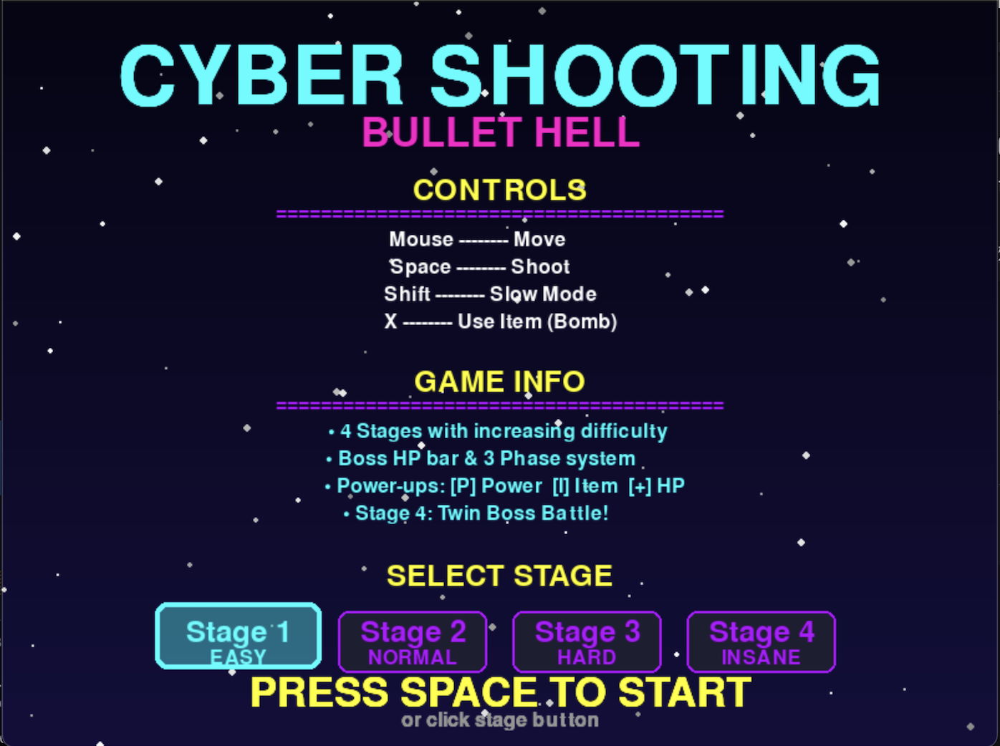

# 🎮MyPyGame - 사이버펑크 슈팅 게임
python과 pygame을 활용한 OOP 기반 탄막 슈팅 게임입니다.



## 🎯 게임 소개
네온 스타일의 비주얼과 다양한 탄막 패턴이 특징인 2D 슈팅 게임

### 게임 특징
* **4개의 스테이지**: 각기 다른 난이도와 보스패턴
* **다양한 탄막 패턴**: 원형, 나선, 호밍, 레이저 등
* **파워업 시스템**: 공격력 강화, 아이템, HP 회복
* **3단계 페이즈 시스템**: 보스 HP에 따른 난이도 증가

## ✨ 주요 기능
### 스테이지 시스템

| 스테이지 | 난이도 | 보스 이름 | 보스 수 | HP | 특징 |
|:---------:|:-------:|:-----------:|:--------:|:----:|:----------------|
| 1 | EASY 👾 | 사이버 비스트 | 1마리 | 500 | 기본 패턴 |
| 2 | NORMAL 🐉 | 드래곤 | 1마리 | 1000 | 호밍 탄막 추가 |
| 3 | HARD ⚡ | 트윈 데몬즈 | 2마리 | 2000 | 레이저 공격 |
| 4 | INSANE 💀 | 썬더 로드 | 3마리 | 1500×2 | 동시 공격 |

### 탄막 패턴

* **Circle Pattern**: 원형 방사 탄막
* **Spiral Pattern**: 나선형 회전 탄막
* **Aimed Burst**: 플레이어 겨냥 부채꼴
* **Homing Missile**: 추적 탄막
* **Laser**: 십자/X자 레이저 (스테이지 3+)
* **Random Spray**: 무작위 분사

### 플레이어 시스템
* **HP**: 3칸(피격 시 2초 무적)
* **파워 레벨**: 1 ~ 3단계(공격력 증가)
* **아이템**: 폭탄(화면 탄막 제거 + 무적)
* **슬로우 모두**: Shift키 클릭시 정밀 조작

### 파워업 시스템
* **Power(P)**: 공격력 증가
* **Item(I)**: 폭탄 획득
* **HP(HP)**: 체력 회복

## 🕹️ 설치 방법
### 저장소 클론

```bash
git clone https://github.com/LeF-0213/MyPyGame.git
cd MyPyGame
```
### 라이브러리 설치

```bash
pip install -r requirements.txt
```
### 게임 실행

```bash
python main.py
```
## 🎮 게임 조작법

| 키 | 기능 |
|:--:|:--|
| 마우스 이동 | 플레이어 이동 |
| 스페이스바 | 공격 (연사) |
| Shift | 슬로우 모드 (정밀 이동 + 히트박스 표시) |
| X | 아이템 사용 (무적2초 + 보스 총알 삭제) |
| R | 재시작 (게임 오버 시) |
| ESC | 게임 종료 |

### 게임 팁
* **슬로우 모드 활용**: Shift를 눌러 정확한 히트박스를 확인
* **무적 시간 활용**: 피격 후 2초간 무적이니 안전한 위치로 이동
* **아이템 아끼기**: 위험한 순간을 위해 아이템 남기기
* **3, 4단계 공략**: 두 보스가 교차 공격

## 📊 게임 시스템
### 점수시스템
* **시간 경과**: 10점/초
* **보스 피격**: 10점/hit
* **파워업 획득**: 50점
* **스테이지 클리어**: 5000점
* **다음 스테이지 진입**: 1000 × 스테이지 번호

## 📁 프로젝트 구조

```m
MyPyGame/
│
├── main.py                      # 게임 실행 파일
│
├── src/                         # 소스 코드
│   ├── __init__.py
│   ├── game.py                  # Game 클래스 (메인 게임 루프)
│   │
│   ├── entities/                # 게임 엔티티
│   │   ├── __init__.py
│   │   ├── game_object.py      # GameObject (추상 클래스)
│   │   ├── player.py           # Player 클래스
│   │   ├── boss.py             # Boss 클래스
│   │   ├── bullet.py           # 탄막 클래스들
│   │   └── powerup.py          # 파워업 아이템
│   │
│   ├── systems/                # 게임 시스템
│   │   ├── __init__.py
│   │   ├── particle.py         # 파티클 시스템
│   │   └── bullet_pattern.py  # 탄막 패턴 팩토리
│   │
│   └── utils/                  # 유틸리티
│       ├── __init__.py
│       ├── constants.py        # 게임 상수
│       └── collision.py        # 충돌 감지
│
├── assets/                     # 게임 에셋
│   └── images/
│       ├── player.png
│       ├── boss.png
│       ├── bullet.png
│       └── background.png
│
├── tools/                      # 개발 도구
│   └── generate_images.py     # 이미지 생성 스크립트
│
├── requirements.txt            # 의존성 패키지
└── README.md                   # 이 파일
```

## 🛠️ 기술 스택
### 언어 & 프레임워크
* **Python 3.8+**: 메인 프로그래밍 언어
* **Pygame 2.5.0**: 게임 엔진
* **Pillow**: 이미지 생성 및 처리

### 개발 방법론
**객체지향 프로그래밍(OOP)**

### 주요 알고리즘
* **원형 충돌 감지**: 두 원의 거리 계산
* **선-점 충돌 감지**: 레이저와 플레이어 충돌
* **벡터 연산**: 이동, 회전, 각도 계산
* **파티클 시스템**: 효과 렌더링

